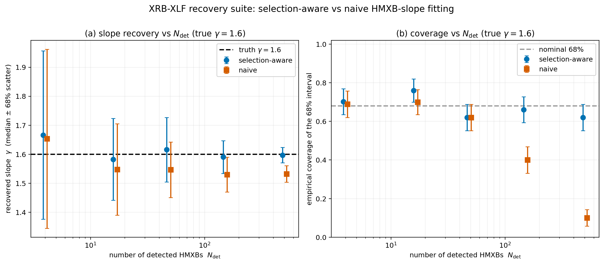
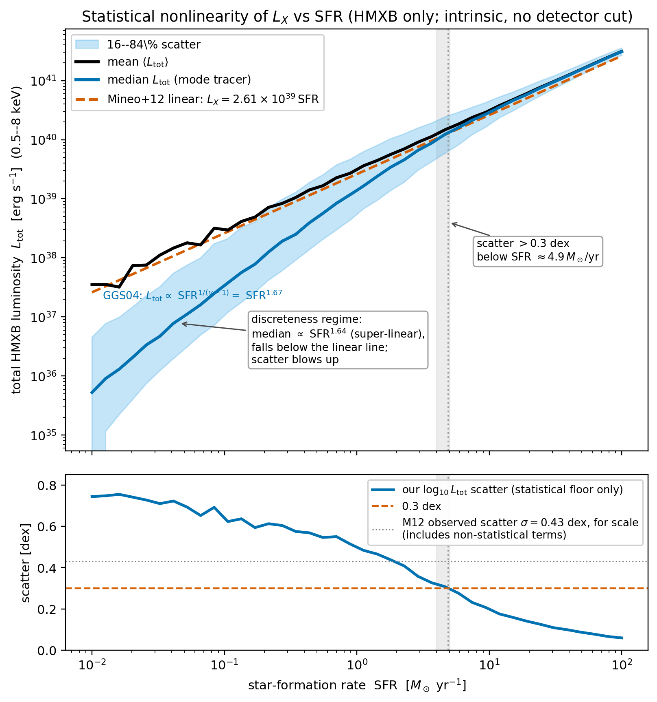
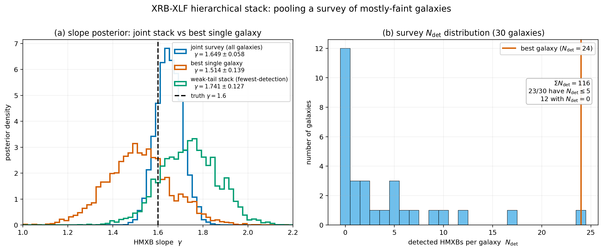
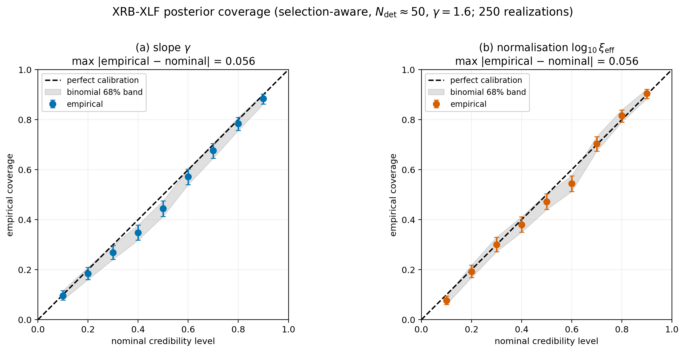
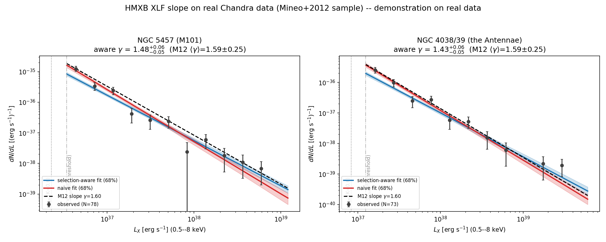

# xrb-xlf-forwardmodel

A forward model and Bayesian inverse for X-ray binary luminosity functions (XLFs). It addresses one question: given realistic detection limits and small-number statistics, how well can you recover the HMXB XLF slope and normalisation from a galaxy's handful of detected sources, and how badly does naive maximum-likelihood fitting get biased when it ignores selection effects? You draw a synthetic XRB population from the standard scaling relations, push it through a realistic observation chain (distance, absorption, a smooth completeness ramp, Poisson count noise producing Eddington bias), then fit the detected luminosities back with an unbinned Poisson-process likelihood, once selection-aware and once with a naive hard flux cut. The output is the bias and coverage gap between the two fits, quantified.

The XLF scaling relations are established (Grimm/Gilfanov/Sunyaev 2003; Gilfanov 2004; Mineo+12; Lehmer+19/24), and the unbinned luminosity-function ML method is Marshall et al. 1983. What this repo adds is a tested implementation of the forward model and selection-aware inference, plus a systematic bias and coverage benchmark that shows where naive fitting fails and by how much. A demonstration fit to two real Chandra catalogues is included at the end, with its caveats.

## Recovery of the XLF slope



*Recovery of the HMXB XLF slope γ vs the number of detected sources N_det, for the selection-aware likelihood (blue) and a naive fit that hard-cuts at the 50%-completeness limit (orange), truth γ = 1.6. Left: the naive fit flattens the recovered slope by Δγ ≈ −0.05 at N_det = 15, and the bias persists at ≈ −0.05 to −0.07 out to N_det = 500; the selection-aware likelihood is unbiased (|Δγ| ≤ 0.02 across the whole 5–500 range) with correctly widening errors. Right: naive 68%-interval coverage collapses from ~0.69 to **0.10** by N_det = 500 (the 68% intervals stop containing the truth), while the selection-aware coverage stays near the nominal 0.68 (0.62–0.78) everywhere. 1480 successful fits over a 5 × 3 × 2 × 50 grid (N_det × γ × fitter × realizations; 1500 cells, 20 skipped at N_det = 5); reproducible from `configs/recovery_suite.yaml` + seed.*

The naive fit hard-cuts at the 50%-completeness limit, the worst case by design. A conservative cut at the 80–90%-completeness limit is nearly unbiased (Δγ ≈ +0.01) but discards the faint sources; the selection-aware likelihood needs no cut and keeps every detected source.

## What it does, stage by stage

The pipeline (`src/xlf_model/`) is a chain of pure, tested functions:

1. **Luminosity functions** (`xlf.py`): HMXB single power law `dN/dL38 = ξ·SFR·L38^(−γ)` with a high-L cutoff (default Mineo+12: ξ = 1.49, γ = 1.60; GGS03 available as a preset). LMXB two-break broken power law scaled to M* (Gilfanov 2004: slopes 1.0/1.86/4.8, breaks 1.9e37 & 5.0e38). Both expose analytic `N(>L)`, expected number, and analytic piecewise inverse-CDF sampling (no rejection), all unit-tested against `scipy.integrate.quad` and brute-force rejection sampling.
2. **Forward model** (`forward.py`): Poisson population draw above L_min; luminosity → flux (distance) × multiplicative absorption; two detector presets (`erosita_erass1`, Merloni+24 F₅₀ = 5×10⁻¹⁴ in 0.5–2 keV; deep `chandra_like`); a smooth error-function completeness ramp instead of a hard cut; Poisson count noise applied to the observed L, so Eddington bias arises near threshold. Funnel accounting per galaxy (drawn → above limit → detected).
3. **Inverse problem** (`inference.py`): the unbinned Poisson-process likelihood `ln L(θ) = Σᵢ ln[dN/dL(Lᵢ)·P_det(Lᵢ)] − Λ(θ)`, with Λ(θ) = ∫ dN/dL · P_det dL the expected detected count. Selection-aware (the completeness ramp) vs naive (a hard flux cut, no ramp, no Eddington awareness) behind one flag. UltraNest (primary) + emcee (fallback); a single-galaxy N_det ≈ 50 fit runs in < 10 s on CPU.
4. **Three experiments**: (a) the recovery suite above; (b) a hierarchical survey stack; (c) the L_X–SFR nonlinearity; (d) posterior coverage validation.

## Additional results

### L_X–SFR nonlinearity (Gilfanov, Grimm & Sunyaev 2004)



For an XLF slope γ < 2 the total-luminosity integral is dominated by the single brightest source, so at low SFR (where the bright end is a coin-flip) the L_X–SFR relation goes nonlinear and scatter-dominated. The forward model reproduces this from first principles: scatter exceeds 0.3 dex below **SFR ≈ 4.9 M☉/yr** (GGS04 threshold ~4–5), and the low-SFR median index is **1.64**, sitting right on the GGS04 small-N prediction 1/(γ−1) = 1.67. This figure checks that the simulator reproduces Gilfanov's statistics paper, going beyond his XLF normalisations.

### Hierarchical survey stack



Thirty galaxies sharing one global HMXB XLF but each with its own SFR, distance, and exposure, fit jointly. 23/30 land in the few-detections regime (12 with zero detections, which are kept and contribute a finite −Λ_g normalisation term). The joint fit is **≈ 2.4× tighter on γ than the single best galaxy** (σ_γ 0.139 → 0.058), and a stack of 10 galaxies with only 1–5 detections each recovers γ as well as the single best 24-source galaxy.

### Posterior coverage validation (Phase 4)



Across 250 independent selection-aware fits at N_det ≈ 50, the q% credible interval contains the truth close to q% of the time. The curve is near-diagonal for both parameters, max deviation 0.056, well inside the conventional ≤ 0.10 criterion. There is a documented ~2% systematic under-coverage at mid-credibility levels, the residual Eddington bias (the likelihood corrects completeness but not the Poisson count-noise scatter). This runs the same coverage methodology as the sibling `sbi-xray-calibration` repo (`src/sbixcal/calibrate.py`): draw datasets from the model, fit, and check that the q% credible region contains the truth q% of the time. There it validates neural posteriors; here it validates an analytic Poisson-process likelihood.

## Prior work

The relations and methods this repo implements:

- **HMXB XLF / SFR scaling:** Grimm, Gilfanov & Sunyaev 2003 (MNRAS 339, 793; L_c = 2.1×10⁴⁰ erg/s); Mineo, Gilfanov & Sunyaev 2012 (MNRAS 419, 2095; ξ = 1.49, γ = 1.60, the default). Modern empirical framework: Lehmer et al. 2019 (ApJS 243, 3) and Lehmer et al. 2024 (arXiv:2410.19901).
- **LMXB XLF / M* scaling:** Gilfanov 2004 (MNRAS 349, 146). LMXB environment / stellar-age dependence: Zhang et al. 2011 (LF of LMXBs in different stellar environments, arXiv:1103.4486) and Zhang, Gilfanov & Bogdán 2012 (stellar-age dependence, arXiv:1202.2331).
- **Small-number statistics / L_X–SFR nonlinearity:** Gilfanov, Grimm & Sunyaev 2004, two papers: the MNRAS Letter (347, L57) and the statistics paper (MNRAS 351, 1365; astro-ph/0312540), the latter being what experiment (c) reproduces.
- **Unbinned luminosity-function ML:** Marshall, Avni, Tananbaum & Zamorani 1983 (ApJ 269, 35; bibcode `1983ApJ...269...35M`).
- **Selection flux limit:** Merloni et al. 2024 (eRASS1 DR1, arXiv:2401.17274); F(0.5–2 keV) > 5×10⁻¹⁴ at 50% completeness.
- **Closest public code:** `popsynth` (Burgess & Capel 2021, JOSS, arXiv:2107.08407) provides generic population-synthesis-with-selection; this repo implements the XRB-XLF-specific physics, likelihood, and bias/coverage benchmark.
- **Samplers:** UltraNest (Buchner 2021, JOSS 6(60) 3001; arXiv:2101.09604) and emcee (Foreman-Mackey et al. 2013).

Band bookkeeping: the config carries explicit `band:` keys and never mixes normalisations across bands (GGS03 is 2–10 keV; Mineo+12 / Lehmer+19 are 0.5–8 keV; the eROSITA limit is 0.5–2 keV). The default simulator is 0.5–8 keV with M12 HMXB + G04 LMXB shapes; G04 luminosities were heterogeneous in the original paper (caveat noted in `configs/xlf_defaults.yaml`).

## Limitations

1. **Residual Eddington bias at the faint end.** The selection-aware likelihood is handed the observed (count-noise-scattered) luminosities and corrects completeness (P_det) but does not deconvolve the Poisson count-noise scatter that produces Eddington bias. The consequence is quantified: at N_det = 5 both fitters carry a small positive γ bias (+0.05 to +0.13, buried in the ~0.29 per-galaxy scatter), and the coverage curve shows a ~2% systematic under-coverage at N_det ≈ 50. It vanishes toward high N / deep surveys (γ recovered to 0.27σ at N_det = 4168). Full noise deconvolution is out of scope; it is documented in RESULTS.md.
2. **No per-galaxy scatter in the hierarchy.** The hierarchical stack uses one shared θ with no log-normal scatter on the per-galaxy normalisation. Per-galaxy scatter is a natural extension that is not implemented here.
3. **The real-data demonstration is not a measurement.** The repo fits two real Chandra catalogues (see Demonstration on real data), but the absolute slopes are confounded by the CXB-affected luminosity regime and the HMXB-only likelihood's omission of a CXB term, so the real-data section demonstrates the machinery and does not measure the XLF.
4. **Sharp high-L truncation.** The cutoff is a sharp truncation (zero above L_cut) rather than an exponential roll-over, kept so every quantity stays exactly analytic and testable. For the default parameters L_cut sits far above the data, so N(>1e38) is insensitive to it.
5. **Single-band, simple absorption.** Absorption is one multiplicative flux factor, and everything lives in one band at a time. This is a population-statistics tool working with luminosity functions; it does not do spectral fitting.

## Quickstart

```bash
# install (Python >= 3.10); add requirements-extension.txt for the real-data demo and its tests
pip install -r requirements.txt

# everything end to end, with funnel-style stage counts (the two fitting
# stages are crash-resumable, so re-running resumes where it stopped):
python scripts/run_all.py                 # add --skip-fits to only redraw figures
                                          # add --workers K to cap parallelism (<=6)

# or per stage (each runs standalone):
python scripts/run_forward_demo.py   --config configs/xlf_defaults.yaml   # funnel + demo fig
python scripts/run_fit_single.py     --config configs/fit_single.yaml     # aware vs naive corner
python scripts/run_recovery_suite.py --config configs/recovery_suite.yaml # the recovery fits
python scripts/analyze_recovery.py   --config configs/recovery_suite.yaml # -> money_plot.png
python scripts/run_coverage.py       --config configs/coverage.yaml       # the coverage fits
python scripts/analyze_coverage.py   --config configs/coverage.yaml       # -> coverage_curve.png
python scripts/run_lxsfr_demo.py     --config configs/lxsfr_demo.yaml     # -> lxsfr_nonlinearity.png
python scripts/run_hierarchical.py   --config configs/hierarchical.yaml   # -> hierarchical_stack.png

# redraw the committed figures from local result tables (after running the suites above):
python scripts/make_plots.py --config all

# tests (every analytic formula vs hand-computed / numerical-integration values):
python -m pytest tests/                   # 80 passed (95 with requirements-extension.txt installed)
```

A short end-to-end narrative is in `notebooks/walkthrough.ipynb` (draw a population, observe it, fit one galaxy aware vs naive, the recovery and coverage curves, the hierarchical stack), committed with outputs.

## Reproducibility

Every run is fully determined by its `configs/*.yaml` (which carries the global seed and every XLF parameter with an inline citation comment) plus the code. No data is committed for the synthetic experiments; everything there is simulated. The committed figures are `money_plot.png`, `coverage_curve.png`, `lxsfr_nonlinearity.png`, `hierarchical_stack.png`, `demo_xlf_draw.png`, and `real_galaxy_fit.png`. The first five are redrawn by `scripts/make_plots.py` from the fitting-run result tables (`results.jsonl`, `coverage_results.jsonl`), which are not committed and are reproduced by re-running the suites from config and seed; `real_galaxy_fit.png` comes from `scripts/run_real_demo.py` (which needs the extension dependencies and fetches the public Chandra catalogues). The fitting runs append one JSON line per fit and are crash-resumable: re-running skips completed fits. Quantitative findings are logged in `RESULTS.md` as they appear.

## Demonstration on real data

As a check that the selection-aware machinery survives contact with real data,
this repo points it at two real public Chandra point-source catalogues from the
Mineo, Gilfanov & Sunyaev 2012 (M12; MNRAS 419, 2095) sample: **NGC 5457 (M101)**
and **NGC 4038/39 (the Antennae)**, the two richest star-forming galaxies by
catalogued HMXB-region source count, fetched from the public HEASARC table
**SFGALHMXB** (`astroquery`, an extension-only dependency in
`requirements-extension.txt`; cached to `data/real/`). Running the repo's existing
unbinned Poisson-process fit
(`python scripts/run_real_demo.py --config configs/real_demo.yaml`) above a
conservative threshold of 1.5× each galaxy's M12 sensitivity limit returns HMXB
slopes **γ = 1.48 (M101)** and **γ = 1.43 (Antennae)** with the selection-aware
likelihood, versus **1.71 / 1.64** for a naive sharp-cut fit. All four are
order-correct: they lie inside M12's own per-galaxy scatter (⟨γ⟩ = 1.59,
rms = 0.25) and straddle the published global γ = 1.60 ± 0.02.

The machinery runs end to end on real data and returns order-correct slopes. The absolute slopes and the ~0.2 aware-vs-naive gap are not interpretable as a clean selection effect, because the fit is dominated by the CXB-affected luminosity regime (log L ≈ 36.5–38.5; M101 has zero fit sources above 10³⁹ erg/s, median fit-source log L ≈ 36.97) and the HMXB-only likelihood omits the cosmic-X-ray-background term M12 modeled explicitly (their Eq. 17). An unmodeled 20–30% CXB contaminant with a flatter logN–logS induces Δγ ≈ −0.04 to −0.20 in the quick run committed here, and up to −0.31 with more realizations, the same sign and size as both the sub-1.60 aware slopes and the whole aware-vs-naive gap (quantified in `scripts/cxb_bias_estimate.py`, see RESULTS). The CXB is a competitive explanation for the offsets.



*HMXB XLF slope fits on real Chandra data (M101, the Antennae). The fitted slopes are order-correct, but the aware-vs-naive gap is confounded by unmodeled CXB contamination and the fit lives in the CXB-affected regime. See the caveats in the text.*

This demonstrates the machinery on real data and is not a survey measurement. The caveats: (i) M12's per-galaxy incompleteness came from Voss & Gilfanov simulations I cannot reproduce, so I approximate it with an erf completeness ramp anchored to M12's quoted K=0.6 sensitivity limit, the only per-galaxy completeness luminosity they tabulate. (ii) CXB contamination is not modeled per source (M12 modeled it explicitly, Eq. 17) and the fit sits inside the CXB-affected regime; the K=0.6 anchor plus the permissive 1.5× threshold push it deeper into the faint, most-contaminated end. (iii) Small N per galaxy. Full numbers, the recomputed fit-threshold table, the CXB-bias estimate, the choice rule, and the complete discussion are in `RESULTS.md` (§ "Demonstration on real data"); the parser, selection approximation, and a frozen-fixture test suite are in `src/xlf_model/real_data.py` and `tests/test_real_demo.py`.

## License

MIT (see `LICENSE`).
